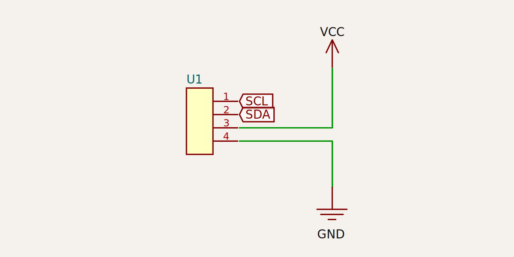

# schematic-corpus

A corpus of schematic layouts made with [tscircuit](https://github.com/tscircuit/tscircuit).

## Building / Automatic Expansion

All circuit.json files in the `dist` directory are converted
to `bpc.json` files. [See BPC Graphs](https://github.com/tscircuit/bpc-graph)

We do not do horizontal mirroring of schematics, but orient
all schematics to be right-facing. It is expected that the
a version of each BPC graph will be mirrored horizontally.

We do not do combinatorial joining of right-facing jumpers with left-facing
jumpers, this should be managed by BPC graph partitioning stages (the stage
prior to matching- you can also run partitioning when there isn't a good matching)

Because we expect paritioning to be run before matching, the corpus should
only include right-facing variants of designs, and should generally avoid having
the "main chip" be two-sided.

Vertical mirroring is never performed.
